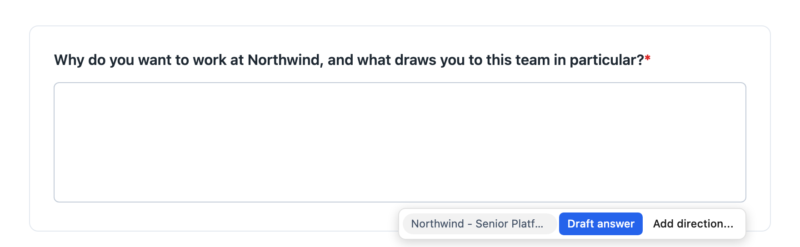
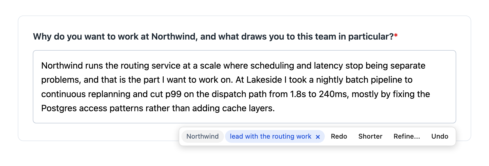
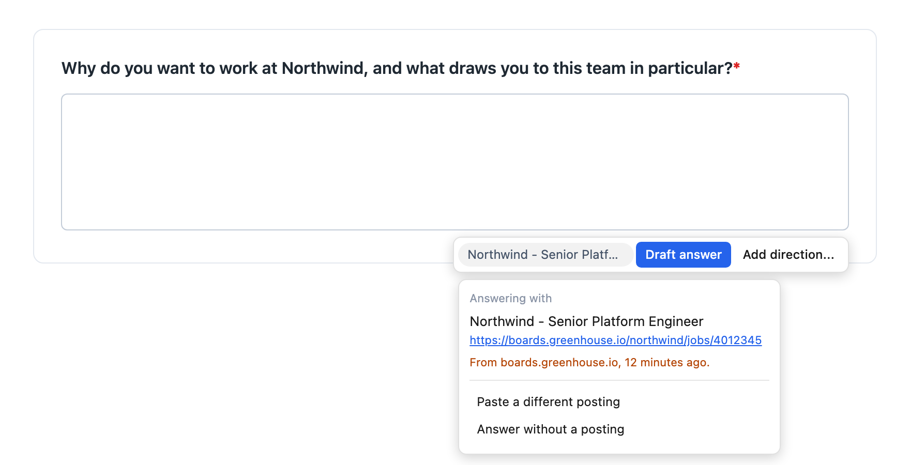

# AI Job Application Drafter

AI drafts your answers to the open-ended questions on job application forms. Chrome extension, your own OpenAI key, your resume stays on your machine.

Click into a question like *"Why do you want to work here?"* and a panel appears under the field. One click writes a draft into the box — no copy-paste step.



Once there is a draft the row turns into revisions. A direction you type stays attached to that question, so Redo and Shorter keep honouring it. Undo gives back whatever *you* had written before the tool first touched the field, not the previous draft.



## Why it exists

Simplify and tools like it already autofill the routine fields — name, email, work authorisation — and do it well. The AI writing is the part behind a subscription, and it was the only part I wanted. So this does that part and nothing else: no autofill, no tracking, no dashboard. It only touches the free-text boxes those tools leave empty.

Built for my own job hunt first. Public because the problem is common, not because it is a product: no store listing, no support, and the defaults are the ones that suited me.

## What it sends

Deliberately little. **One request per click** — no agent loop, no retries, no extra call to work out what the question was.

| Per request | Roughly |
| --- | --- |
| System prompt | 310 tokens |
| Your resume | 750 for a 3,000-character resume |
| Job description | up to 1,500, clipped at 6,000 characters |
| The question, plus the previous answer when revising | 100 |

**~2,600 tokens for a typical draft, ~1,100 with the posting switched off.** A few cents an application instead of a monthly fee.

What it never sends: the page, its DOM, the form, the other questions on it, or anything you answered earlier. Finding the question and reading the job posting are done locally with heuristics, not by asking a model — so no page content is ever uploaded, only the four things above.

## How it works

**It waits for you.** It never scans the page for fields and runs no MutationObserver. The panel appears when you focus a field with a recognisable question near it, and stays quiet everywhere else.

Textareas, rich text boxes, and short `<input>` questions all count. Two things keep it off the rest of the web: code and chat editors (CodeMirror, Monaco, ProseMirror, Lexical, Quill) are skipped outright, and a question guessed from nearby text or a placeholder has to actually read like one. A label pointing straight at the field is trusted as-is. Single-line inputs are held to the strictest bar — an explicit, question-shaped label and no `autocomplete` hint — because otherwise every search box on the web qualifies.

**It finds the job posting.** Reads Schema.org `JobPosting` JSON-LD, falling back to `og:` tags only where the URL is plausibly a posting at all. Postings are kept for the browser session, so a description read on a company careers page is still there when the form turns out to live on Greenhouse.

Matching runs in tiers, most trustworthy first:

| Tier | Rule |
| --- | --- |
| `manual` | You pasted it in for this site |
| `page` | Captured on this exact URL |
| `origin` | Captured on this host |
| `recent` | Captured anywhere in the last 30 minutes |

Only the last is a guess, so **the panel always names the posting it picked and says where it came from** — a wrong match is visible rather than silent. If it is wrong, or nothing was found, or what was found is a bare page title with no description, the panel says so and you can paste the real one in. Once per site, not once per question.



The amber line is the tell. A posting found on the page you are filling in reads *"Found on this page."* in grey; only the cross-host reach gets flagged.

## Install

No store listing. Load it unpacked:

```bash
npm install && npm run build
```

Open `chrome://extensions`, turn on Developer mode, choose **Load unpacked**, select `dist/`.

## Setup

Click the toolbar icon for settings:

1. **API key** — yours, from [platform.openai.com](https://platform.openai.com/api-keys). Billed to your account.
2. **Model** — free text, so a newer model works without a new build.
3. **Resume** — pasted as plain text. No file upload on purpose: whatever you uploaded would be flattened to text anyway, and this way you see exactly what the model sees. If you paste out of a PDF, read it back first — two-column layouts interleave into nonsense on copy, and every answer would quietly inherit that.

The resume is the single source of truth for every answer, so keep it current. A stale graduation date produces answers claiming you are still in school.

## Privacy

- **The API key never leaves the service worker.** Content scripts run in the page context of whatever job site you are on, so they never see it.
- **Your resume and the matched posting go to OpenAI with every request**, under your own key. Nowhere else — there is no server in this project.
- **Settings and resume live in `chrome.storage.local`**, unencrypted on disk in your Chrome profile.
- **Captured postings live in `chrome.storage.session`** and are gone when you close the browser.

## Development

```bash
npm run build      # bundle to dist/
npm run watch      # rebuild on change
npm run typecheck  # tsc --noEmit
npm run fixture    # build the fixtures below
npm run icons      # re-render icon PNGs (needs rsvg-convert)
npm run shots      # re-render README images (needs Chrome, macOS path)
```

`icons` and `shots` output is committed, so a normal build needs neither.

There is no test runner. `npm run fixture` builds self-scoring HTML pages you open in a browser; each exercises the real modules and prints a pass/fail list.

| Page | Covers |
| --- | --- |
| `dist/fixture.html` | Pulling the question text off a field |
| `dist/job.html` | Reading a posting off a page, and the matching tiers |
| `dist/flow.html` | The content script end to end, against a stubbed background |
| `dist/prompt.html` | What actually reaches the API, plus a dump of the full prompt |
| `dist/panel.html` | Every panel state, for eyeballing |
| `dist/shot.html` | The source of the images above |

`flow.html` drives the real content script and calls the real background functions, faking only `chrome.storage`, so the rules under test are the shipped ones.

Every case exists because something was actually wrong. Three of them:

- Leaving a field and coming back wiped the pre-insert value, quietly turning Undo into *restore the answer we just wrote*.
- Reloading the extension orphans content scripts in open tabs, where `chrome.runtime.sendMessage` throws **synchronously** — where no `.catch` on the returned promise can see it.
- The prompt never stated the current date, so a model with no clock read `Sep 2024 - Jun 2026` as ongoing and insisted the candidate was still enrolled.

## Layout

```
src/background/   service worker; the only context that reads the API key
src/content/      field detection, question extraction, the panel, insertion
src/lib/          prompt assembly, posting matching, storage, provider adapter
fixtures/         self-scoring dev pages
```

Adding another LLM provider is one branch in `src/lib/llm.ts` and nothing else.

## License

MIT
